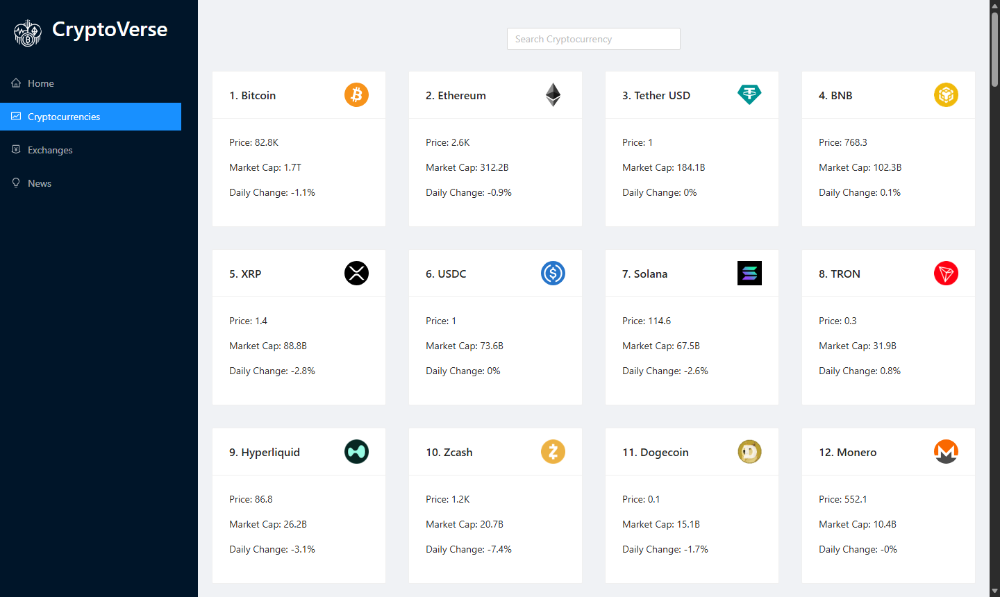
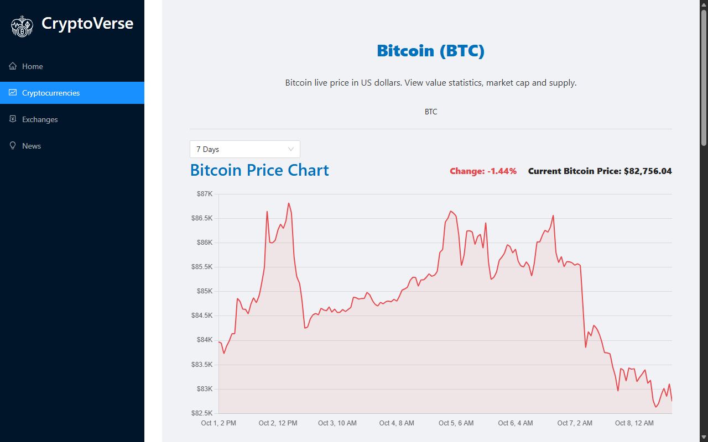
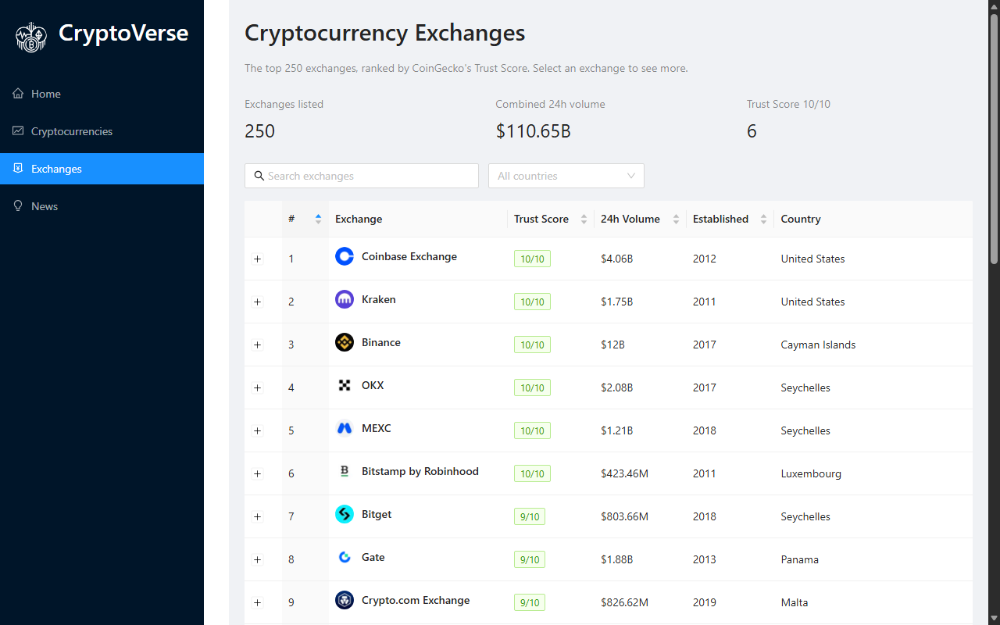
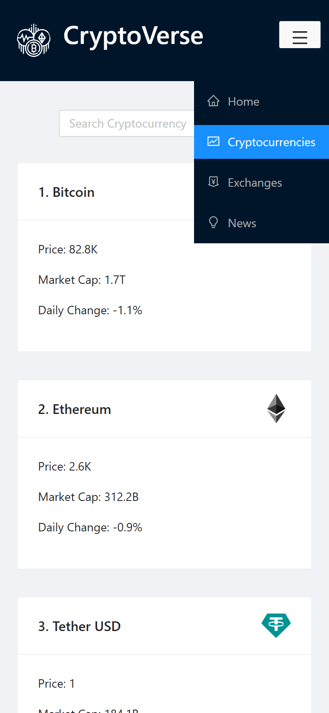

# CryptoVerse

A cryptocurrency dashboard with live prices, price charts, news and exchange rankings, built with React, Redux Toolkit (RTK Query) and Ant Design.

**Live demo: [cryptoverse-fawn.vercel.app](https://cryptoverse-fawn.vercel.app)**



## Features

- **Every listed coin**: around 2,400 coins, searchable by name. The first 100 appear straight away while the full list loads in the background, with a "Load more" button for the rest.
- **Coin pages**: live price, value statistics, supply data and a price chart with 11 time periods, from 1 hour to all time.
- **Coin descriptions**: full write-ups grouped under subheadings such as how the coin works, its supply, history and adoption.
- **Exchanges**: the top 250 exchanges ranked by CoinGecko's Trust Score, with search, a country filter, sortable columns and expandable details.
- **News**: the latest crypto articles from CoinDesk, each opening in a new tab.
- **Home page**: global market stats, the top 10 coins and the latest news.
- **Mobile friendly**: on phones the sidebar becomes a top bar with a collapsible menu.

<p>
  
  
</p>
<p align="center">
  
</p>

## Tech stack

- **React 17** and **React Router 5**
- **Redux Toolkit**, using RTK Query for data fetching and caching
- **Ant Design 4** for the UI and **Chart.js 3** (react-chartjs-2) for price charts
- **html-react-parser** for rendering coin and exchange descriptions
- **Vercel** for hosting and a serverless API function

## How it works

| Data | Source |
|---|---|
| Coin prices, market stats and price history | [Coinranking API](https://rapidapi.com/Coinranking/api/coinranking1) on RapidAPI |
| Coin descriptions and exchanges | [CoinGecko API](https://www.coingecko.com/en/api) (free, no key needed) |
| News | [CoinDesk](https://www.coindesk.com/)'s RSS feed, converted to JSON by [rss2json](https://rss2json.com/) |

The RapidAPI key never reaches the browser. The app calls its own `/api/coinranking` serverless function ([api/coinranking.js](api/coinranking.js)), which:

- adds the key on the server
- only allows the Coinranking endpoints the app uses
- trims coin lists to the fields the app shows, making them about 6x smaller
- lets Vercel's CDN cache successful responses for a minute, so visitors share requests

During local development, [src/setupProxy.js](src/setupProxy.js) serves the same function from the Create React App dev server.

### Project structure

```
api/coinranking.js    Serverless function that calls Coinranking with the API key
src/app/store.js      Redux store
src/services/         RTK Query APIs for Coinranking, CoinGecko and the news feed
src/components/       Pages and UI components
src/utils/            Number formatting and the description subheadings helper
```

## Run it locally

You need Node.js 18 or later and a free RapidAPI account subscribed to the [Coinranking API](https://rapidapi.com/Coinranking/api/coinranking1).

1. Clone the repository and install dependencies:

   ```bash
   git clone https://github.com/mahianyuallan/cryptoverse.git
   cd cryptoverse
   npm install
   ```

2. Create a `.env` file in the project root with your RapidAPI key:

   ```
   RAPIDAPI_KEY=your-rapidapi-key
   ```

3. Start the app on [http://localhost:3000](http://localhost:3000):

   ```bash
   npm start
   ```

## Deploy

Import the repository into [Vercel](https://vercel.com/new) and add `RAPIDAPI_KEY` as an environment variable. [vercel.json](vercel.json) sets the build command and routes every page to the app, so links like `/crypto/...` work on refresh.

Vercel builds with `CI=true`, which makes Create React App treat lint warnings as errors. Run `CI=true npm run build` locally before pushing to catch them (in PowerShell: `$env:CI="true"; npm run build`).

## Credits

Started from JavaScript Mastery's [Cryptoverse tutorial](https://github.com/adrianhajdin/project_cryptoverse) (2021), then rebuilt for today's APIs: the tutorial's Bing News API has been retired and Coinranking's exchanges endpoint is no longer on the free plan. Market data comes from Coinranking and CoinGecko, and news from CoinDesk.
